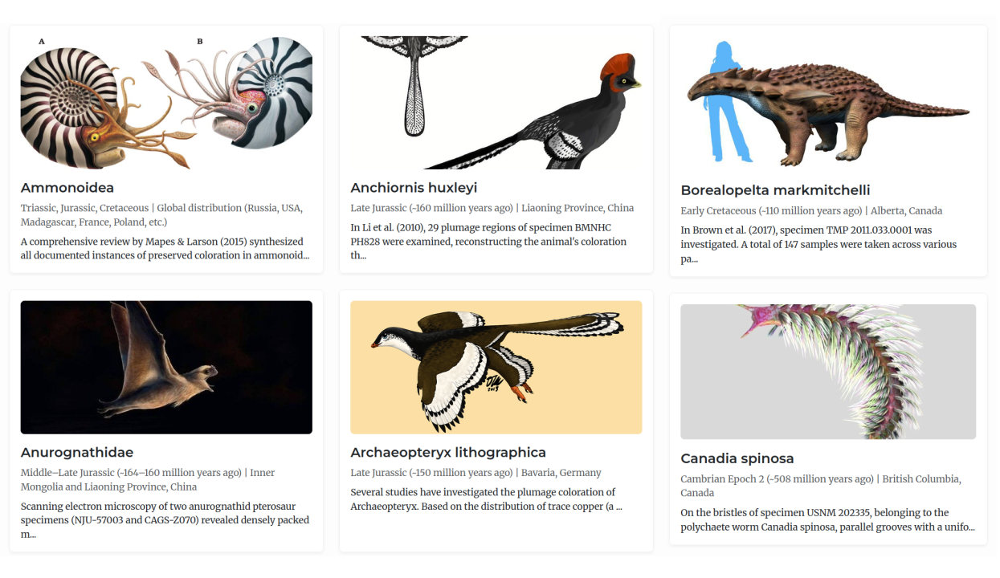

  

You can check out the database [here](https://dmitrylashinmsu.github.io/PaleoColor_static/en/index.html). You will find a list of these animals with a short summary of each, artistic reconstructions, and links to the original research papers.

The website features representatives of every period from the Cambrian to the Cretaceous. Their coloration has been studied using a wide range of methods:

- The well-known melanosome analysis of feathered dinosaurs
- Direct observation of the original colors of birds preserved in Burmese amber
- The analysis of diffraction gratings on the setae of Cambrian polychaetes
- The prediction of color patterns based on the scale morphology of Edmontosaurus mummies from the United States

Enjoy exploring!